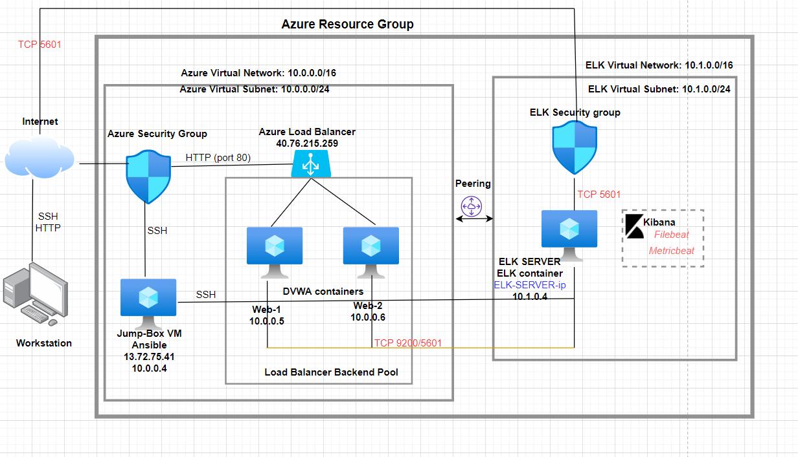

# ELk-Project
#These files have been tested and used to generate a live ELK deployment on Azure. They can be used to either recreate the entire deployment pictured above. Alternatively, select portions of the yml and config file may be used to install only certain pieces of it, such as Filebeat.

* 
## Automated ELK Stack Deployment

